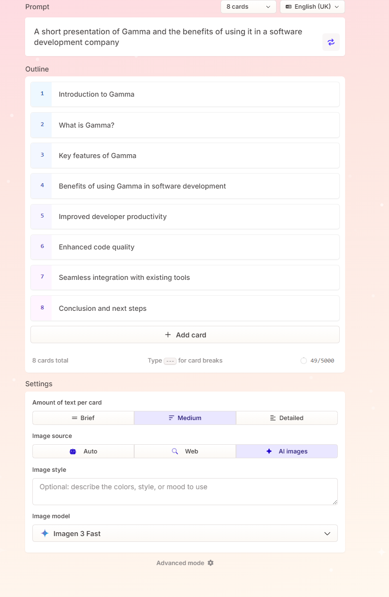

[Back to the Report](../report.md)

# Gamma

[Website](https://gamma.app/)

## Description

Gamma.app is a dynamic tool designed to create visually engaging, interactive presentations and documents with ease. It enables teams to streamline the process of turning complex information into clear, appealing formats without needing advanced design skills. Gamma.app simplifies collaborative content creation, allowing users to embed rich media, create responsive designs, and ensure presentations adapt seamlessly across devices.

## Personal Experience/Testing

We tested Gamma using some of the free credits you get when signing up. The process to create a presentation using a single line prompt to AI was super simple. After giving it your prompt, it asked a few clarifying questions, like the level of detail per slide, where to get images from, and gave you the option to customise the them and layout before it generated the content.
The quality of the content it generated was very good, and you still have the ability to edit it and customise as much as you need to.

## Opportunity for TechForge

TechForge really wants to maximise the value of time spent and increase collaboration. Gamma makes it really easy to create engaging presentations that will help improve how teams interact internally as well as share information with stakeholders. While saving lots of time that would normally be spent creating a presentation

## Benefits for TechForge

- Enhanced Collaboration: Teams across front-end, DevOps, and customer support can collaboratively create presentations and reports, reducing silos.
- Efficiency: The tool’s ease of use reduces time spent on formatting, allowing teams to focus on innovation and customer solutions.
- Improved Client Communication: Gamma’s visually appealing outputs help present complex software solutions more clearly to clients, enhancing customer experience.
- Adaptability: Gamma’s responsive designs ensure presentations work seamlessly on various platforms, aligning with TechForge’s modern tech stack and agile processes.

## Potential Risks

As with all AI tools, you should share the information without checking it first and making sure it is accurate and you understand what is being presented. AI tools are a support for what you do, rather than a replacement.

## Recommendation

Gamma clearly has a lot of features that would benefit the whole company, but in particle, has a lot of features that would benegit a development team, saving a lot of time, delivering value soon and promoting collaboration. Used sensibly, we would recommend Gamma.

## Supporting resources

[Gamma Slideshow](../resources/gamma%20presentation.pdf)
