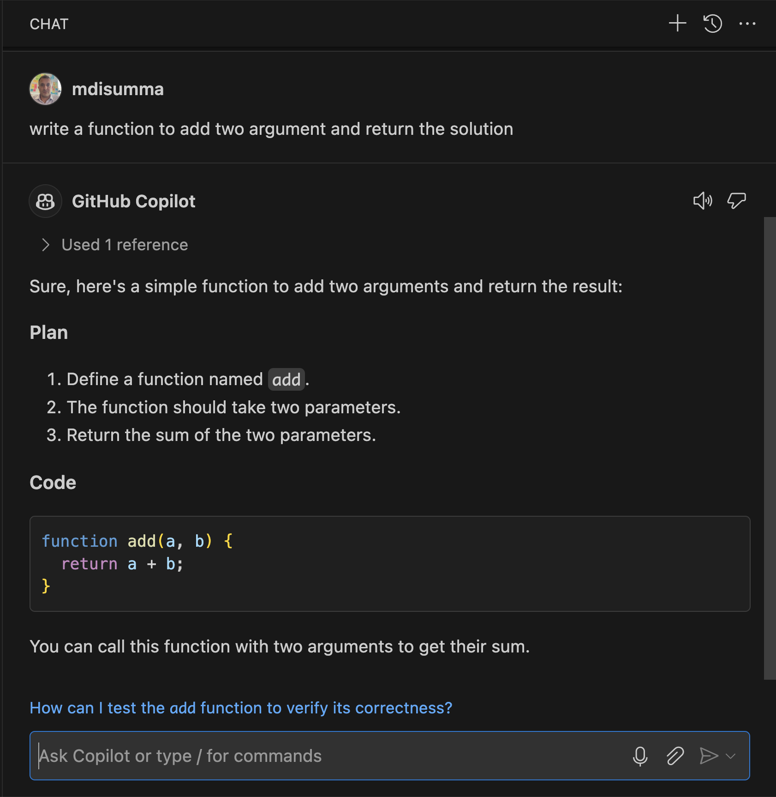

[Back to the Report](../report.md)

# GitHub Copilot

[Website](https://github.com/features/copilot)

## Description

GitHub Copilot is an AI-powered code completion tool developed by GitHub and OpenAI. It acts as an assistant within integrated development environments (IDEs) like Visual Studio Code, helping software engineers by suggesting lines of code, completing functions, or even generating entire code blocks based on comments or existing code.

## Personal Experience/Testing

By testing GitHub Copilot, we quickly used autocomplete to write functions and methods from the JavaScript library. The AI tool assisted in the development phase by alerting us to errors and suggesting code refactoring. Using prompts, Copilot provided solutions to pseudocoded tasks and optimized the generated code.

## Opportunity for TechForge

TechForge really wants to maximise the value of time spent on production. GitHub copilot makes it really easy providing code suggestion to speed up the time spent on producing boilerplate code. By handling repetitive or simpler code tasks, engineers can focus on more complex problem-solving, boosting efficiency in projects.

## Benefits for TechForge

- Faster Code Autocompletion and Suggestions
- Provides instant code snippets and completions based on the current context.
  Boilerplate Code Generation
- Quickly generates repetitive, standard code structures, reducing manual effort.
  Error Reduction and Improved Code Quality
- Suggests syntactically correct code, minimizing errors and debugging time.
  Context-Aware and Efficient Algorithm Suggestions
- Offers relevant code based on project context, speeding up complex logic implementation.
  Quick Learning and Adoption of New Libraries
- Suggests usage examples for unfamiliar libraries or APIs, reducing research time.

## Potential Risks

Developers may become too dependent on Copilot, leading to reduced understanding of core coding concepts and problem-solving skills. Additionally, the quality of AI-generated code can be inconsistent, and it may reinforce outdated or biased patterns.

## Recommendation

Mitigating these risks thorough review and validation of Copilot's suggestions are essential.

## Supporting links

